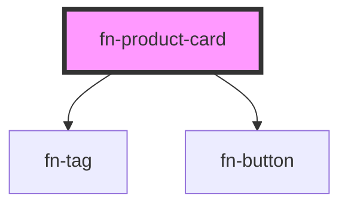

# fn-product-card

<!-- Auto Generated Below -->

## Properties

| Property | Attribute | Description          | Type           | Default     |
| -------- | --------- | -------------------- | -------------- | ----------- |
| `code`   | `code`    | Product code         | `string`       | `'000000'`  |
| `image`  | --        | Product image URL    | `ProductImage` | `undefined` |
| `name`   | `name`    | Product name         | `string`       | `''`        |
| `price`  | --        | Product price object | `ProductPrice` | `undefined` |
| `tags`   | --        | Product tags         | `ProductTag[]` | `undefined` |

## Events

| Event       | Description | Type               |
| ----------- | ----------- | ------------------ |
| `addToCart` |             | `CustomEvent<any>` |

## Dependencies

### Depends on

- [fn-tag](../fn-tag)
- [fn-button](../fn-button)

### Graph

----------------------------------------------

*Built with [StencilJS](https://stenciljs.com/)*
